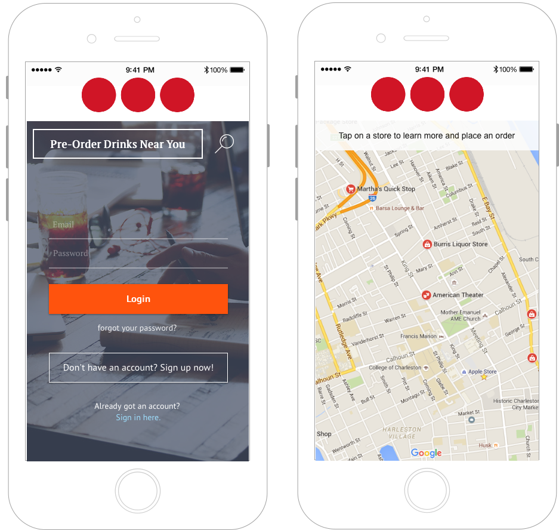
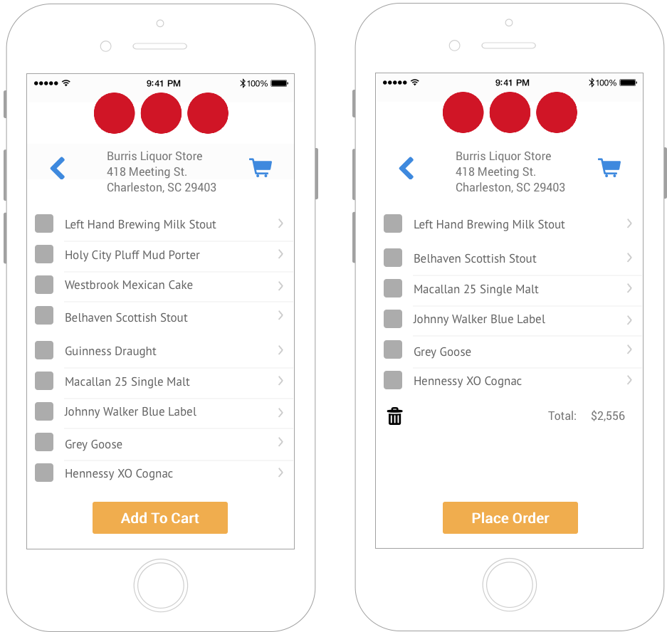
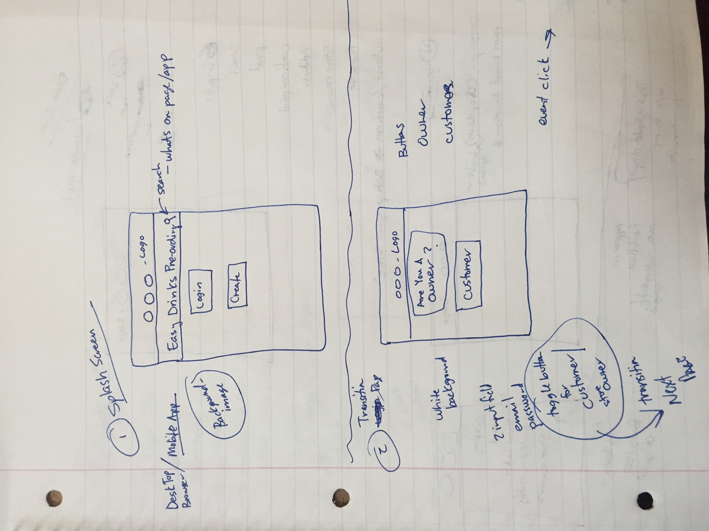
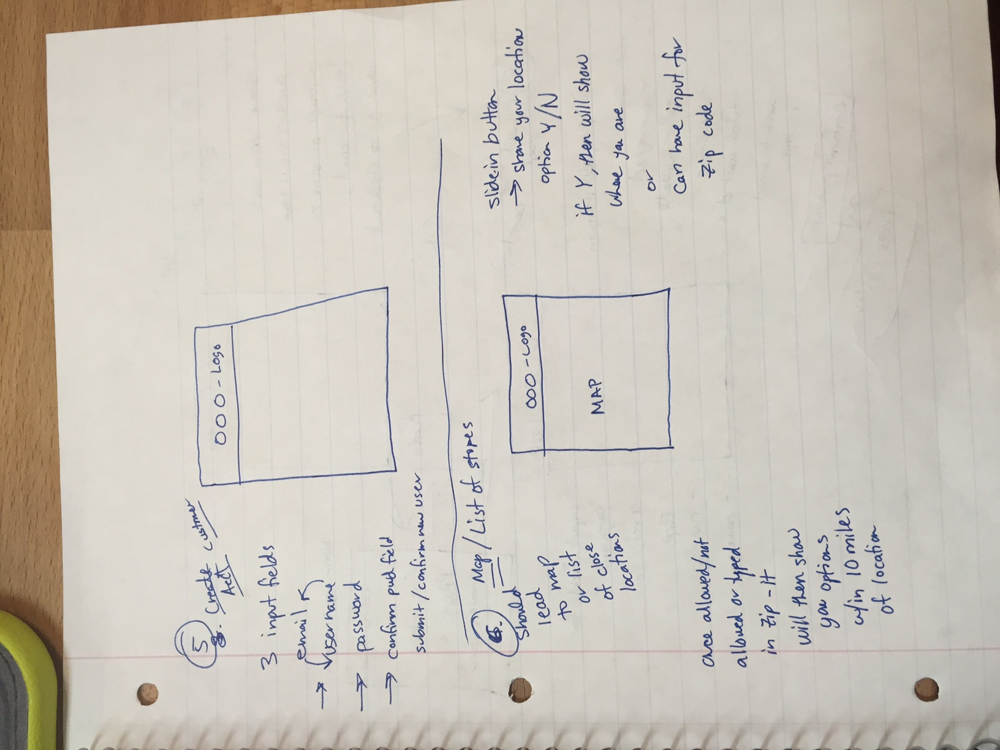
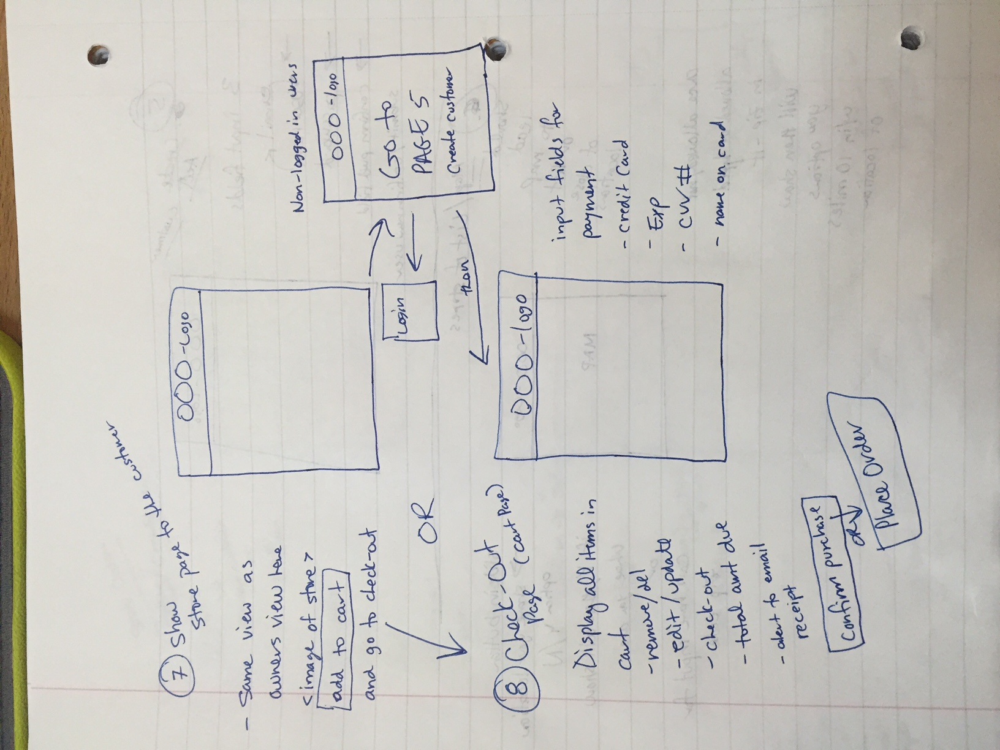
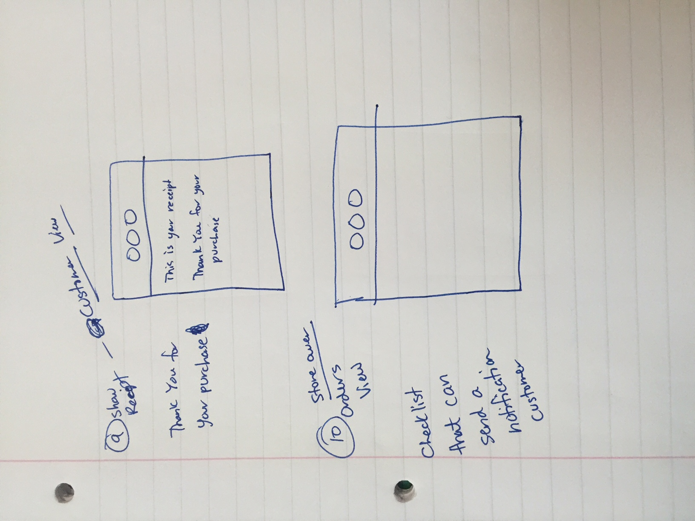

# Red Dots

### The Iron Yard Demo Day - 8th January 2016

## Elevator Pitch
Alcohol pre-order app for party peeps! Order and pay ahead through the app for pick-up. Must show ID. Delivery from participating stores where legal.

## Brief
The Red Dots app lets users find liquor stores nearby, pre-order and pay for alcohol in the app. Users then pick-up the items from the store without having to fall in line. They simply show their ID to claim the product. Where legal, stores are given to option to make delivery available.

## Technologies

* Javascript
* Angular
* Mongo.db
* Node.js
* Express.js
* Websockets
* Ionic
* HTML / CSS

## MVP Features

### For Users

* User Login
* User Profile (editable)
* List of Stores and locations
* List of Stores’ items
* Shopping Cart

### For Stores

* Store Login
* Store Profile (editable)
* Inventory CRUD

### For App Admins

* List of Stores
* List of Users
* CRUD for Stores and Users

## Wishlist / “Low Priority”

### For Users
* Map of stores around you
* View of store if delivery is available
* Current orders, past orders
* Support chat

### For Stores

* Current orders
* Total Sales for the week, month, and year
* Blog by stores
* Support chat

### For Admins
* Payment Gateway for Users

## User Stories

### Users can create a New User account via email and password

* Value Statement: By making it simple and easy for users to sign-up for the service, users will have a good user experience by making it easy for them to see what the app has to offer while their interest is fresh.

* Acceptance Criteria:  A working sign-up form that saves new users to the database which includes a profile picture.

### Store Owners can create a New Store account via email, password, store name, store address, store phone number

* Value Statement: By allowing stores to setup a vendor account, they become part of the network of stores that make their business available to users.

* Acceptance Criteria:  A working sign-up form that saves new stores to the database which includes a store image.

### Store Owners should be able to input and edit categorized inventory and pricing

* Value Statement: Store owners can monitor, and update their inventory that shows on the app.

* Acceptance Criteria:  Stores can add inventory and upload images.

### Admins can CRUD both users and stores

* Value Statement: Admins can provide a consistent user experience for both sides.

* Acceptance Criteria:  A working app.

### Users can add to shopping cart, view it, and checkout

* Value Statement: By making it simple and easy for users to buy items and edit their cart, we create a user experience that is standard across the web and most modern shopping sites / apps.

* Acceptance Criteria:  A working shopping cart.

### Email signup form

* Value Statement: This lets users stay connected and updated for new store updates, products, tastings, and deals.

* Acceptance Criteria:  Successful integration with MailChimp.

### Conversion to mobile app

* Value Statement: Making it convenient for users to have the app with them at all times on their mobile phones.

* Acceptance Criteria:  A working sign-up mobile app.

### Push Notifications for users

* Value Statement: Notify users of ready orders, new blog posts, tastings, and deals.

* Acceptance Criteria:  A few working notifications.

### Push notifications for Stores (and/or email)

* Value Statement: Notify stores of new orders.

* Acceptance Criteria:  A few working notifications.

## Wireframes

